## redis基础及搭建

## redis环境搭建

##### 传输redis压缩包

通过远程登陆把redist.tar.gz压缩包上传到服务器的opt文件夹中

##### 安装c语言编译环境

测试系统是否已经安装gcc指令`gcc --version`

运行命令`yum install gcc`安装gcc

##### 解压redis压缩包

进入opt文件夹执行命令`tar -zxvf redis-7.0.4.tar.gz`

##### 编译

进入redis-7.0.4.tar.gz文件夹中执行`make`命令   

如果编译出错可以通过指令`make dictclean`删除编译文件

##### 安装

在redis-7.0.4文件夹中执行`make install`进行安装 默认安装在usr/local/bin目录下

##### 启动

进入usr/local/bin目录下执行`redis-server`启动redis服务

以守护进程模式启动服务：

	- 把opt/redis-7.0.4文件夹中的redis.conf复制到usr/local/etc文件夹中
	- 修改redis.conf文件中的daemonize值 改为yes  并把注释去掉
	- 在usr/loacl/bin目录下执行`redis-server ../etc/redis.conf`

## 小知识

### 后台运行redis

把redis.conf中的dzemonize改为yes

### 保护模式

redis默认在不设密码的状态下是开启protected-mode的

## 安全

### 设置密码

可以通过指令`config get requirepass`指令查看是否设置了密码验证

客户端连接上后执行`config set requirepass root`root即为设置的密码  此方法设置的密码服务重启后失效 也可以通过修改redis.conf文件中的`requirepass`设置密码(默认注释掉的)

设置密码后通过指令`AUTH <password>`进行密码验证

## redis性能测试

指令格式`redis-benchmark [option] [option value]` 注意该命令实在redis目录下执行 而不是客户端内部指令

redis性能测试可选参数

| 选项               | 描述                                       | 默认值    |
| ------------------ | ------------------------------------------ | --------- |
| -h                 | 指定服务器主机名                           | 127.0.0.1 |
| -p                 | 指定服务器端口                             | 6379      |
| -s                 | 指定服务器 socket                          |           |
| -c                 | 指定并发连接数                             | 50        |
| -n                 | 指定请求数                                 | 10000     |
| -d                 | 以字节的形式指定 SET/GET 值的数据大小      | 2         |
| -k                 | 1=keep alive 0=reconnect                   | 1         |
| -r                 | SET/GET/INCR 使用随机 key, SADD 使用随机值 |           |
| -P                 | 通过管道传输 <numreq> 请求                 | 1         |
| -q                 | 强制退出 redis。仅显示 query/sec 值        |           |
| --csv              | 以 CSV 格式输出                            |           |
| -l（L 的小写字母） | 生成循环，永久执行测试                     |           |
| -t                 | 仅运行以逗号分隔的测试命令列表。           |           |
| -I(i的大写字母)    | Idle 模式。仅打开 N 个 idle 连接并等待。   |           |

## redis客户端连接

Redis 通过监听一个 TCP 端口或者 Unix socket 的方式来接收来自客户端的连接，当一个连接建立后，Redis 内部会进行以下一些操作

	- 首先，客户端 socket 会被设置为非阻塞模式，因为 Redis 在网络事件处理上采用的是非阻塞多路复用模型
	- 然后为这个 socket 设置 TCP_NODELAY 属性，禁用 Nagle 算法
	- 然后创建一个可读的文件事件用于监听这个客户端 socket 的数据发送

### 最大连接数

可以通过修改`redis.conf`文件的maxclients值

也可以通过启动服务时指令`redis-sever --maxclients 10000`设置

可以通过客户端内部指令`config get maxclients`查看设置客户端连接数最大值

### 客户端命令

| 命令           | 描述                                       |
| -------------- | ------------------------------------------ |
| CLIENT LIST    | 返回连接到 redis 服务的客户端列表          |
| CLIENT SETNAME | 设置当前连接的名称                         |
| CLIENT GETNAME | 获取通过 CLIENT SETNAME 命令设置的服务名称 |
| CLIENT PAUSE   | 挂起客户端连接，指定挂起的时间以毫秒计     |
| CLIENT KILL    | 关闭客户端连接                             |

## 

## 通用

`keys *`查询所有的key

`exists <key>`查看该key是否存在

`type <key>`查看key的类型

`del <key>`删除key

`unlink <key>`异步删除key

`expire <key> <time duriction>`为key设置一个过期时间（秒）

`ttl <key>`查看剩余过期时间

`select <db>`切换数据库

`dbsize`返回数据库key数量

`flushdb`删除数据库中所有内容

`flushall`删除所有数据库

### string字符串

`set <key> <value>`设置k_v

`get <key>`获取v

`append <key><value>`在key对应的值中追加value

`strlen <key>`返回key对应value的长度

`setnx <key> <value>`设置k_v，如果库中已经存在key，返回0

`incr <key>`key对应的值加一

`decr <key>`key对应的值减一

`incrby <key> <num>`key对应的值加num

`decrby <key><num>`key对应的值减num

`mset <key1><value1> <key2><value2>...`设置多k_v

`mget <key1><key2>...`获取多k_v

`msetnx <key1><value1> <key2><value2>...`设置多k_v,只要库中有任意一个key存在，就设置失败

`getrange <key> start end`获取key对应value中索引start至end的字符

`setrange <key><offset><value>`添加value在key的值域中offset位置

`setex <key> <timeduriction><value>`设置有寿命的k_v  单位秒

`getset <key><value>`获取key的值并用新值替换旧值

`watch <key>...`监视key的变化

`unwatch `取消监视

#### 底层实现

#### **SDS简单动态字符串**

简单动态字符串（Simple Dynamic String 简称sds），Redis将SDS作为默认字符串

SDS结构定义

```go
/*
 * redis中保存字符串对象的结构
 */
struct sdshdr {
    //用于记录buf数组中使用的字节的数目，和SDS存储的字符串的长度相等 
    int len;
    //用于记录buf数组中没有使用的字节的数目 
    int free;
    //字节数组，用于储存字符串
    char buf[]; //buf的大小等于len+free+1，其中多余的1个字节是用来存储’\0’的
};
```

当free=0时表示buff没有任何空闲空间

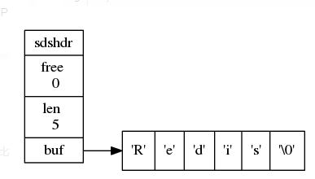

当free=5 len=5时表示buff中有5个数据和5个空闲

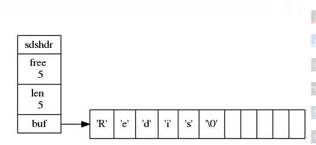

SDS和c中字符串的区别

- 获取字符串的长度

  SDC有len属性可以直接获取长度，其时间复杂度为O(1)，而c中的字符串获取长度需遍历字符串，时间复杂度为O(n)

- 内存分配策略

​		对于c中的字符串而言，无论是字符串的拼接还是缩短都需要对底层char数组的扩展，再进行数据的拷贝

​		SDS的内存分配策略与之不同，可概括为**预分配和惰性释放**

​		**预分配**

​		（1）如果对SDS字符串修改后，len的值小于1MB，那么程序会分配和len同样大小的空间给free，此时len和free的值			是相同。
​			例如：如果SDS的字符串长度修改为15字节，那么会分配15字节空间给free，SDS的buf属性长度为15（len）+15			（free）+1（空字符） = 31字节。

​		（2）如果SDS字符串修改后，len大于等于1MB，那么程序会分配1MB的空间给free。
​			例如：SDS字符串长度修改为50MB那么程序会分配1MB的未使用空间给free，SDS的buf属性长度为 50MB			（len）+1MB（free）+1byte（空字符）。

​		**惰性释放**

​			当需要缩短SDS字符串时，程序并不立刻将内存释放，而是使用free属性将这些空间记录下来，实际的buf大小不			会变，以备将来使用。

- 缓冲区溢出

​			SDS的字符串的内存预分配策略能有效避免缓冲区溢出问题；C字符串每次操作增加长度时，都要分配足够长度			的内存空间，否则就会产生缓冲区溢出（buffer overflow）

- 二进制安全

​			（1）C字符串的编码是ASCII编码，在字符串的末尾是以”\0“结束，也就是空字符，所以在字符串中不能包含空字			符，要不然会让程序误以为结束，这也限制了C字符串只能保存文本数据，不能保存图片，音频，视频等二进制数			据。

​			（2）SDS以二进制存储数据的，可以存储任意数据。因此不管buf保存什么格式的数据，存入什么数据，读取			的就是什么数据，二进制安全。

- SDS兼容部分c字符串函数

​		SDS总会在buf[]数组分配空间时，多分配一个字节来存储空字符(’\0’)，便于重用C中的函数。

### list 列表


单键多值，底层双链表实现

`lpush <key> <value1><value2>...`设置列表

`lpop <key>`取值

`lrange <key> start end`取索引在start和end之间的值

`rpoplpush <key1><key2>`在key1的右边取值放入到key2的左边

`lindex <key><index>`取指定索引的值

`llen <key>`返回链表长度

`linsert <key> before/after <value> <newvalue>`在value的前面/后面插入新值

`lrem <key> <num> `从链表左边删除num个值

`lset <key> <index> <value>`给key的链表中索引为index换新值

#### 底层实现

list的体层实现是quicklist，一个双向链表

#### **quicklist（快速列表）结构**

quicklist是一个双向链表，且是由ziplist作为节点组成的双向链表 结构图如下

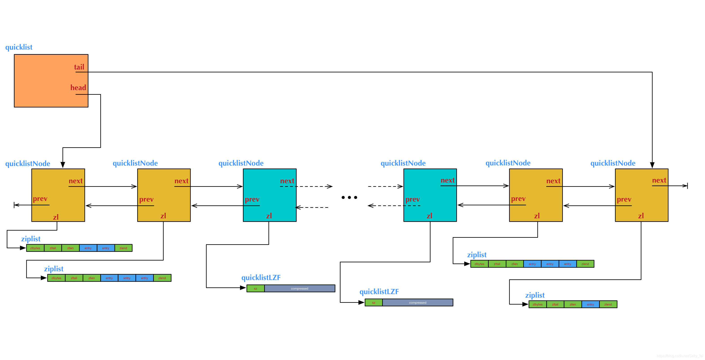

快速列表这样设计是一个空间和时间的折中

- 双向链表便于表的插入和删除，但是他的内存开销大，他的每个节点除了要保存数据外还要保存两个指针，另外每个节点是单独的内存块，节点多了容易产生内存碎片
- ziplist（压缩表）是一个连续的内存，所以存储效率高。但是他不利于修改，每次数据的变动都会引发一次连续内存的重新分配（realloc），而且当ziplist特别长的时候，一次realloc会导致大批量的数据拷贝，进一步降低性能

依次可见快速表节点上的压缩表要保持合理的长度，压缩表的合理长度取决于具体的应用场景。

Redis提供了配置参数`list-max-ziplist-size`来根据实际情况进行配置

- 当其值为正数时表示这个ziplist最多包含的数据项
- 当其值为负数时表示按照字节数来限定每个ziplist的长度，这时它只能取-1~-5这五个值

示例

```go
list-max-ziplist-size 5//表示quicklist节点中的ziplist最多有5个数据项

list-max-ziplist-size -1//当为负值时
/*每个值含义如下：
-5: 每个quicklist节点上的ziplist大小不能超过64 Kb。（注：1kb => 1024 bytes）
-4: 每个quicklist节点上的ziplist大小不能超过32 Kb。
-3: 每个quicklist节点上的ziplist大小不能超过16 Kb。
-2: 每个quicklist节点上的ziplist大小不能超过8 Kb。（-2是Redis给出的默认值）
-1: 每个quicklist节点上的ziplist大小不能超过4 Kb
*/
```

除此之外，list是用来存储很长的数据列表的。当列表很长时，最容易被访问的是两端的数据，中间的数据被访问的可能性很低，Redis还提供了压缩中间结点的配置参数`list-compress-depth`，这个参数值表示快速表两端不被压缩的结点个数

```go

#参数表示一个quicklist两端不被压缩的节点个数
list-compress-depth 3 //redis默认值为0
3: 表示quicklist两端各有3个节点不压缩，中间的节点压缩。

```


### set 无序集合


string类型的无序集合，底层是一个hash表实现

`sadd <key><value1><value1>...`设置集合

`smembers <key>`返回集合中的元素

`sismembers <key><value>`判断是否为集合中的元素

`scard <key>`返回元素个数

`srem <key><v1><v2>...`删除

`spop <key>`随机突出一个元素

`srandmembers <key> <num>`随机返回num个元素 不删

`smove <souce><destination><member>`把source中的member移动到destination中

`sinter <key1><key2>`返回交集

`sunion <key1><key2>`返回并集

`sdiff <key1><key2>`返回差集，包含key1不包含key2

#### 底层实现

intset（整数集合）是Redis集合的底层实现之一，当存储整数集合并且数据量较小的情况下Redis会使用intset作为set的底层实现，当数据量较大或者集合元素为字符串时则会使用dict实现set。

#### **inset**

inset数据结构定义

```go
typedef struct intset {
    uint32_t encoding; //intset的类型编码
    uint32_t length; //集合包含的元素数量
    int8_t contents[]; //保存元素的数组
}
```

- inset整数集合特点

​		1、所有的元素都保存在contents 数组中，且按照从小到大的顺序排列，并且不包含任何重复项。

​		2、intset将整数元素按顺序存储在数组里，并通过二分法降低查找元素的时间复杂度。

​		3、虽然contents 数组申明成了int8_t类型，但contents数组中具体存储什么类型完全取决于encoding变量的值，类似		于继承。它可以保存具体类型为int16_t、int32_t 或者int64_t 的整数值。

- 元素升级

​		当新增的元素类型比原集合元素类型的长度要大时(比如：原来是int16_t，现在新增一个int64_t的元素)，需要对整数		集合进行升级，才能将新元素放入整数集合中。具体步骤：

​		1、根据新元素类型，扩展整数集合底层数组的大小，并为新元素分配空间。

​		2、将底层数组现有的所有元素都转成与新元素相同类型的元素，并将转换后的元素放到正确的位置，放置过程中，		维持整个元素顺序都是有序的。

​		3、将新元素添加到整数集合中（保证有序）

​		注意：升级能极大地节省内存；整数集合不支持降级操作，一旦对数组进行了升级，编码就会一直保持升级后的状		态。


#### **dict字典**

dict是一个用于维护key和value映射关系的数据结构，与很多语言中的Map或dictionary类似。Redis的一个database中所有key到value的映射，就是使用一个dict来维护的。dict本质上是为了解决算法中的查找问题(Searching)。

1.一般查找问题的解法分为两个大类

    #1.一般查找问题的解法分为两个大类
        一个是基于各种平衡树，一个是基于哈希表，平常使用的各种Map或dictionary，大都是基于哈希表实现的。
     
    #2.dict的算法实现
        dict也是一个基于哈希表的算法，跟java中的hashMap类似，dict采用某个哈希函数从key计算得到在哈希表中的位置，采用拉链法解决冲突，
    并在装载因子（load factor）超过预定值时自动扩展内存，引发重哈希（rehashing）。


dict的数据结构定义

```go
 typedef struct dict{
    dictType *type; //直线dictType结构，dictType结构中包含自定义的函数，这些函数使得key和value能够存储任何类型的数据
    void *privdata; //私有数据，保存着dictType结构中函数的 参数
    dictht ht[2]; //两张哈希表
    long rehashidx; //rehash的标记，rehashidx == -1,表示没有进行 rehash
    int itreators;  //正在迭代的迭代器数量
  }dict;
```

为了能更清楚地展示dict的数据结构定义，用一张结构图来表示dict(字典)的构成。如下图：

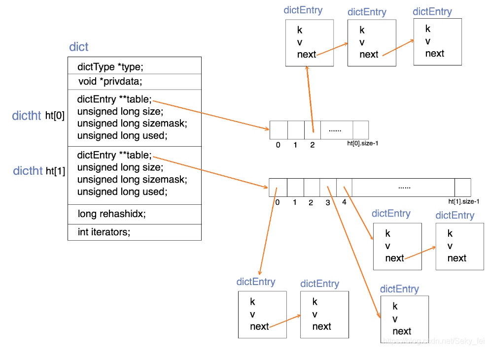

上图就是Redis的dict(字典)数据结构，一个dict需要注意几点：

- dict采用哈希函数对key取哈希值，得到在哈希表中的位置(桶的位置)，再采用拉链法解决hash冲突。

- 两个哈希表（ht[2]）：只有在重哈希的过程中，ht[0]和ht[1]才都有效。而在平常情况下，只有ht[0]有效，ht[1]里面没有任何数据。上图表示的就是重哈希进行到中间某一步时的情况。

- 重哈希过程：跟HashMap一样，当装载因子（load factor）超过预定值时就会进行rehash。dict进行重hash扩容是将ht[0]上某一个bucket（即一个dictEntry链表）上的每一个dictEntry移动到扩容后的ht[1]上，更触发rehash的操作有查询、插入和删除元素。每次移动一个链表（即渐进式rehash）原因是为了防止redis长时间的堵塞导致不可用。

- dict添加操作：如果正在重哈希中，会把数据插入到ht[1]；否则插入到ht[0]。

- dict查询操作：先在第一个哈希表ht[0]上进行查找，再判断当前是否在重哈希，如果没有，那么在ht[0]上的查找结果就是最终结果。否则，再在ht[1]上进行查找。查询时会先根据key计算出桶的位置，在到桶里的链表上寻找key。

- dict删除操作：判断当前是不是在重哈希过程中，如果是只在ht[0]中查找要删除的key；否则ht[0]和ht[1]它都要查找删除。
  

### hash


`hset <key><field><value>`设置字段和值

`hget <key><field>`获取某字段值

`hexists <key><field>`判断某字是否存在

`hkeys <key>`获取所有的字段名

`hvals <key>`获取所有的字段值

`hincrby <key><field><num>`为field字段加num

`hsetnx <key><field><value>`为field字段设置值，如果存在则设置失败

`hmset <key><field1><value1><field2><value2>...`批量添加

#### 底层实现

在field较少且value较小时采用ziplist实现，随着field增多和value的增大，hash可能变成dict来实现。当hash的底层变成dict来实现时，它的存储效率就变低了

### Zset有序集合


每个元素带有一个分数，根据分数对元素进行升序排序

`zadd <key><score1><value1><score2><value2>...`

`zrange <key><start><end>[withscores]`返回下表在start和end之间的有序集，可以带上每个元素的分数

`zrangebyscore <key> min max [withscores][limit offset count]`返回分数在min和max之间对应元素组成的集合，可以和分数一并返回  升序排序

`zrangebyscore <key> max min [withscore][limit offset count]`同上，降序排序

`zrem <key><value>`删除该集合中指定元素

xxxxxxxxxx8 1func main() {2    str := "hello 沙河"3    err := ioutil.WriteFile("./xx.txt", []byte(str), 0666)4    if err != nil {5        fmt.Println("write file failed, err:", err)6        return7    }8}go

`zrank <key><value>`返回该元素在集合中排名（从0开始）

`zincrby <key><increment><value>`为指定元素value的分数加increment

#### 底层实现

底层实现的市局结构有skiplist、ziplist

#### **skiplist（跳表）**

skiplist查找效率很高，堪比优化过的二叉平衡树(红黑树)，且比平衡树的实现简单，查找单个key，skiplist和平衡树的时间复杂度都为O(log n)。平衡树的插入和删除操作可能引发树的旋转调整，逻辑复杂，而skiplist的插入和删除只需要修改相邻节点的指针，操作简单又快速。

skiplist首先它是一个list。实际上，它是在有序链表的基础上发展起来的。先来看一个有序链表，如下图（最左侧的灰色节点表示一个空的头结点）：

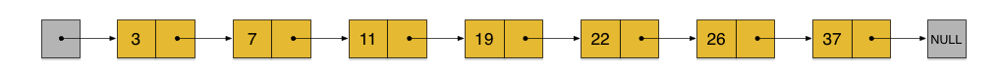

这样种链表中，如果要查找某个数据，需要从头开始逐个进行比较，直到找到等于 或 大于(没找到)给定数据为止，时间复杂度为O(n)。同样，当插入新数据的时候，也要经历同样的查找过程，从而确定插入位置。

有了上面出现的问题后进一步优化，假如我们这样来设计，在每相邻两个节点增加一个指针，让指针指向下下个节点，如下图：

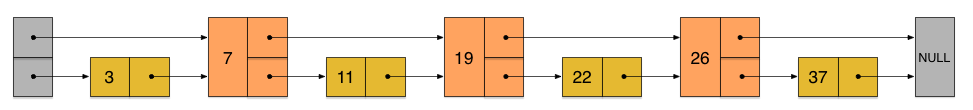

这样所有新增加的指针连成了一个新的链表，但它包含的节点个数只有原来的一半（上图中是7, 19, 26）。现在当查找数据的时候，可以先沿着这个新链表(第一层链表)进行查找。当碰到比待查数据大的节点时，再回到第二层链表进行查找。

比如，要查找23，查找的路径是沿着下图中标红的指针所指向的方向进行的：整个查询路线如红色箭头。

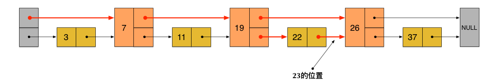

先在第一层链表上查询，23首先和7比较，再和19比较，比它们都大，继续向后比较。但23和26比较的时候，比26要小，因此回到下面的链表（原链表），与22比较。

再在第二层链表上查询，23比22要大，沿下面的指针继续向后和26比较。23比26小，说明待查数据23在原链表中不存在，而且它的插入位置应该在22和26之间。

在这个查找过程中，由于新增加的指针，不再需要向原链表一样，每个节点都逐个进行比较。需要比较的节点数大概只有原来的一半。 利用同样的方式，可以在上层新产生的链表上，继续为每相邻的两个节点增加一个指针，从而产生第三层链表。如下图：

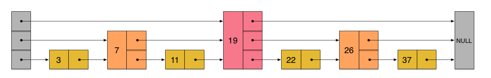

在这个新的三层链表结构上，如果还是查找23，那么沿着最上层链表首先要比较的是19，发现23比19大，接下来我们就知道只需要到19的后面去继续查找，从而一下子跳过了19前面的所有节点。可以想象，当链表足够长的时候，这种多层链表的查找方式能让我们跳过很多下层节点，大大加快查找的速度。

skiplist正是受这种多层链表的想法的启发而设计出来的，实际上，按照上面生成链表的方式，上面每一层链表的节点个数，是下面一层的节点个数的一半，这样查找过程就非常类似于一个二分查找，使得查找的时间复杂度可以降低到O(log n)。但是，这种方法在插入数据的时候有很大的问题。新插入一个节点之后，就会打乱上下相邻两层链表上节点个数严格的2:1的对应关系。如果要维持这种对应关系，就必须把新插入的节点后面的所有节点（也包括新插入的节点）重新进行调整，这会让时间复杂度重新蜕化成O(n)。删除数据也有同样的问题。

skiplist为了避免这一问题，它不要求上下相邻两层链表之间的节点个数有严格的对应关系，而是为每个节点随机出一个层数(level)。比如：一个节点随机出的层数是3，那么就把它链入到第1层到第3层这三层链表中。

skiplist中一个节点的层数（level）是随机出来的，而且新插入一个节点不会影响其它节点的层数。因此，插入操作只需要修改插入节点前后的指针，而不需要对很多节点都进行调整。这就降低了插入操作的复杂度。而节点的层数（level）也不全是没有规则随机的，而是按照节点平均指针数目计算出来的。如下图各个节点层数（level）是随机出来的一个skiplist，我们依然查找23，查找路径如图：

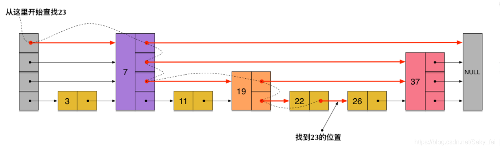

skiplist与平衡树、哈希表的比较

skiplist 和 各种平衡树（如AVL、红黑树等）的元素是有序排列的，而哈希表不是有序的。因此，在哈希表上只能做单个key的查找，不适宜做范围查找。

平衡树的插入 和 删除操作可能引发树的旋转调整，逻辑复杂，而skiplist的插入和删除只需要修改相邻节点的指针，操作简单又快速。

查找单个key，skiplist和平衡树的时间复杂度都为O(log n)，大体相当；而哈希表在保持较低的哈希值冲突概率的前提下，查找时间复杂度接近O(1)，性能更高一些。

从内存占用上来说，skiplist比平衡树更灵活一些。平衡树一般每个节点包含2个指针，而skiplist每个节点包含的指针数目平均为1/(1-p)，具体取决于一个概率参数p。如果像Redis里的实现一样，取p=1/4，那么平均每个节点包含1.33个指针，比平衡树更有优势。


## redis6的新数据类型

### bitmaps

**指令**

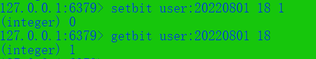

`setbit<key><offset><value>`设置Bitmaps中某个偏移量的值（0或1）

`getbit<key><offset>`获取bitmaps中某个偏移量的值

`bitcount <key>[start end [BYTE|BIT]]`返回字符串中从start到end字节比特值位1的数量

`bitcount<key>[start end]`统计字符串被设置为1的bit数 指定额外的参数start或end可以让计数只在特定的位上进行

`bitop and/or/not/xor <destkey>[key...]`bitop是一个复合操作  and交集  or并集  not非  xor异或 将结果保存在destkey中

实例：某个用户是否访问过网站，将访问过的标记为1，没有访问过的标记为0，偏移量标记为用户id

* 很多用户id以一定数字开头，如果以bitmaps和用户id对应会造成一定浪费，通常做法是用户id减去这个值。

* 在初始化bitmaps时，如果偏移量较大，那么初始化过程会比较慢，可能会造成redis阻塞

### HypeLoglog

`pfadd <key><value1><value2>...`自动去重

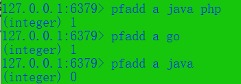

`pfcount <key>`统计集合中基数的数量

`pfmerge <key> <key2><key3>`把key2和key3合并为key

### Geospatial 地图

`geoadd <key><longitude><latitude><member>...`添加地理位置（经度，纬度，名称）

`geopos <key><member>[member...]`获取指定地区的坐标值

`geodist <key><member1><member2>`[m|km|ft|mi]获取两个位置之间的直线距离

`georadius <key><longitude><latitude>radius m|km|ft|mi`以给定的经纬度为中心，找出给定 半径范围内的地区

* 注意：两极无法直接添加 
* 有效经度从-180到180，纬度从-85.05112878到85.05112878  超出范围返回一个错误
* 单位默认为 m米  km千米  mi英里   ft英尺

## redis的事务操作

`multi`开始组合命令

`discard`放弃命令组队

`exec`执行命令

`watch <key>...`监视一个或多个key，如果事务开始前这些key的值发生变化，那么这些事务就会被打断

`unwatch <key>...`取消监视这些key的值

**注意**：

  如果在组队时格式出现错误，执行时组内命令都不会执行

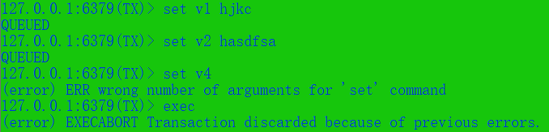

如果在组队时没有出错，在执行时出错，则出错的那条命令执行失败，其他的命令正常执行


### 乐观锁

顾名思义，就是每次拿数据时认为别人不会修改，所以不会上锁，但是在更新的时候会判断一下此期间别人有没有更新这个数据，可以使用版本号的机制。乐观锁适用于多读的应用场景，这样可以提高吞吐量。redis就是通过这种check-and-set机制实现事务的。

### 悲观锁

对于操作上锁，影响效率。

### redis事务特性

- 隔离操作：事务中所有命令都会顺序的执行，不会被其他客户端所打断

- 没有隔离级别：所有的命令在未提交之前都没有被实际执行

-    非原子性：如果一条命令执行失败，其他命令正常执行，没有回滚

  

  


## redis持久化

### 数据的备份与恢复

备份：通过`SAVE`指令用于创建当前数据库的备份 该指令会在redis的安装路径下创建dump.rdb文件

​		创建redis备份文件也可通过指令`BGSAVE`,该命令在后台执行

恢复：只需要将dump.rdb移动到redis的安装目录下启动服务即可

​		查看redis安装路径指令`CONFIG GET dir`


### RDB:

（默认开启 文件名：dump.rdb）

- 通过在临时区复制数据然后赋值到磁盘，可能会丢失数据。在复制数据时占用两倍内存容量，影响性能。

### AOF: 

(默认关闭 文件名：appendonly.aof )aof的开启：把配置文件中的appendonly no改为yes

- 客户端的请求写命令会被append到AOF缓冲区内，

- AOF缓冲区会根据AOF持久化策略[always everysec no]将操作sync同步到磁盘的AOF文件中 

- AOF文件大小超过重写策略或手动重写时会对AOF文件rewrite重写，压缩AOF文件容量

- 如遇AOF文件损坏，通过/usr/local/bin/redis-check-aof--fix appendonlydir/appendonly.aof进行修复

  **重写机制**

  aof采用文件追加方式，文件会越来越大为避免出现此种情况，新增了重写机制，当aof文件大小超出所设定的阈值时，redis就会启动aof文件内容压缩，只保留可以恢复数据的最小指令集。可以使用命令bgrewriteaof

  重写的实现：

  aof重写和rdb过程一样，就是先fork出一个子进程将文件重写（先写临时文件然后rename）

  重写的触发：

  redis会记录上次rewrite的文件大小，默认是aof文件比上次大一倍且文件大于64MB触发

  `auto-aof-rewrite-percentage`设置重写的基准值，文件达到100%，即原来文件的两倍。

  `auto-aof-rewrite-min-size`设置文件的基准值，最小文件64MB，达到这个值开始重写

  缺点：

  	- 相比rdb更占用内存空间
  	- 恢复备份速度慢
  	- 每次写与备份同步的话，有一定的性能压力
  	- 存在bug造成恢复不能

 - 若两者同时开启系统默认AOF


## 主从复制（master/slaver）

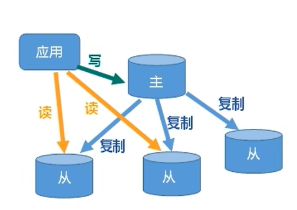

- 读写分离

  master负责写  slave负责读

- **一主多从设置**

  创建一个文件夹myredis，把redist.conf复制到文件夹中，同时在文件夹中创建多个配置文件*.conf

  把redis.conf文件中的daemonize的no改为yes  即后台挂起

  配置文件内容为 

​		`include /myredis/redis6380.conf`引入公共文件  绝对路径

​		`pidfile /var/run/redis_6380.pid`设置进程名称

​		`port 6380`设置监听端口号

​		`dbfilename dump6380.rdb`设置持久化文件名称

​		以redis-cli -p <port>连接redis服务  

​		info replication 指令可以查看当前服务的master/slave信息 

​		通过slaveof <master ip> <master port>设置当前服务为slave （设置成功后当前服务只能    		读数据 不能写）

#### 主从复制过程

- 当slave连接到master成为slaver时，slaver主动向master发送同步数据请求
- 当master收到slaver的同步请求后，master把数据持久化到磁盘rdb文件中，把rdb文件发送到slaver
- slaver收到rdb文件进行数据的读取

**注意**

-  全量复制 slaver接收到数据库文件后，将其存盘并加入到内存中
- 增量复制 master每次进行写操作时都会主动同步到slaver
- 每一次slaver重新连接master都会进行全量复制

#### 薪火相传

任何一个slaver都可以成为另外一个slaver的master

例：m1（master）是s1（slaver）的master，s1（slaver）可以称为s2（slaver）的master

#### 反客为主

**手动版**： 任何一个拥有slaver的slaver都可以在自己的master挂掉后通过slaveof no one使自己成为master

**自动版：**

​	哨兵模式：

````
```go
//开启哨兵模式
redis-sentinel  myredis/sentinel.conf
//哨兵默认监视127.0.0.1 6379   相关设置在sentinel.conf中
//sentinel monitor mymaster 127.0.0.1 6380 1
//mymaster为为监控对象起的名字，后面的127.0.0.1为master的地址，6380为master的端口号，1为至少1个哨兵同意迁移的数量
```
````

```go
选择条件
1、选择性优先级靠前的 优先级在redis.conf中默认:replica-priority 100 值越小优先级越高
2、选择偏移量最大的
3、选择runid最小的从服务 每个redis实例启动后都会随机生成一个40位的runid
```

**注意：**当master关闭后哨兵根据规则选举出新master后，原有的master重新启动后会默认称为master的slaver

## redis集群搭建

**注意:**

- 在多台服务器搭建集群时注意把`bind 127.0.0.1 `注释掉，把`protected-mode yes`改为no
- 注意服务器安全组中加入数据端口和集群总线端口，两者的偏移量为10000  例：数据端口6379 集群总线端口16379
- 连接集群 `redis-cli -h [ip] -p [port] -c`
- 认证 `auth [password]`

```go
//redis*.conf配置文件修改
//redis*.conf文件内容
include /myredis/redis.conf  // 从根目录开始
pidfile /var/run/redis_*[端口号].pid
port [port]
dbfilename dump*[端口号].rdb
cluster-enabled yes //打开集群模式
cluster-config-file nodes-*[端口号].conf//设置节点配置文件
cluster-node-timeout 15000 //设置节点失联时间，超过该时间（毫秒），集群自动进行主从切换
```

创建六个集群实例后，进入安装redis地址的src路径下执行下列命令（注意注释redis.conf中的bind 127.0.0.1和protected mode设置为no）

```go
redis-cli --cluster create --cluster-replicas 1 172.19.68.86:6380 172.19.68.86:6381 172.19.68.86:6382 172.19.68.86:6390 172.19.68.86:6391 172.19.68.86:6392
//此处不要用127.0.0.1，用真实ip  --cluster-replicas 1 以最简单的模式创建 即一个master配备一个slaver
//分配原则 各个主从服务器在不同的地址
```

```go
//以集群方式连接
redis-cli -c -p 7001
//查看集群状态
cluster nodes
```

一个集群中一共有16384（0~16383）个slot(插槽)均匀的分布在集群的各个master中，如果master挂掉其slaver上位,如果该master重新启动则变为slaver

**注意：**如果一段插槽的主从都宕掉，redis服务是否继续依赖于cluster-require-full-coverage的值，如果是yes则整个集群都挂掉，如果为no则只是该段插槽不提供服务（数据不能读取，也不能往此段插槽写入数据）。

### redis分区

分区是分割数据到多个Redis实例的处理过程，因此每个实例只保存key的一个子集。

#### 范围分区

最简单的分区方式是按范围分区，就是映射一定范围的对象到特定的Redis实例。

比如，ID从0到10000的用户会保存到实例R0，ID从10001到 20000的用户会保存到R1，以此类推。

这种方式是可行的，并且在实际中使用，不足就是要有一个区间范围到实例的映射表。这个表要被管理，同时还需要各 种对象的映射表，通常对Redis来说并非是好的方法。

#### 哈希分区

另外一种分区方法是hash分区。这对任何key都适用，也无需是object_name:这种形式，像下面描述的一样简单：

- 用一个hash函数将key转换为一个数字，比如使用crc32 hash函数。对key foobar执行crc32(foobar)会输出类似93024922的整数
- 对这个整数取模，将其转化为0-3之间的数字，就可以将这个整数映射到4个Redis实例中的一个了。93024922 % 4 = 2，就是说key foobar应该被存到R2实例中。注意：取模操作是取除的余数，通常在多种编程语言中用%操作符实现。

## 发布订阅

开启三个客户端

第一个客户端发布  发布格式`PUBLISH <频道名> 消息`

另外两个客户端订阅频道  订阅格式`SUBSCRIBE <频道名>`

**重点：**发布与订阅的实现基于客户端连接的是同一个redis服务器 

## 管道技术

Redis是一种基于客户端-服务端模型以及请求/响应协议的TCP服务。这意味着通常情况下一个请求会遵循以下步骤：

- 客户端向服务端发送一个查询请求，并监听Socket返回，通常是以阻塞模式，等待服务端响应。
- 服务端处理命令，并将结果返回给客户端。

### redis管道技术（未完）

Redis 管道技术可以在服务端未响应时，客户端可以继续向服务端发送请求，并最终一次性读取所有服务端的响应

## 缓存穿透

## 缓存击穿

## 缓存雪崩

## 分布式锁

```
- 基于数据库实现分布式锁
- 基于缓存（redis）实现分布锁
- 基于zookeeper实现分布式锁
```

### ACL(access contral list)访问控制列表

```go
acl list
acl cat
```

 
