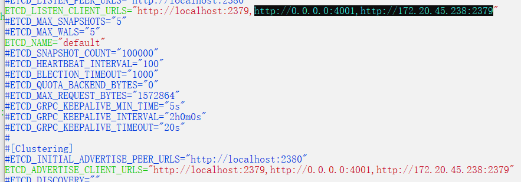

# docker的安装与常用指令

[docker官方文档](https://docs.docker.com/engine/install/centos/)

## docker的卸载与安装

### 1、docker的卸载

```docker
 sudo yum remove docker 
                  docker-client \
                  docker-client-latest \
                  docker-common \
                  docker-latest \
                  docker-latest-logrotate \
                  docker-logrotate \
                  docker-engine
```

### 2、设置仓库

```docker
yum install -y yum-utils
```


### 3、建立仓库

```docker
## 安装Docker所需要的一些工具包
sudo yum install -y yum-utils
 
## 建立Docker仓库 (映射仓库地址)
sudo yum-config-manager \
    --add-repo \
    https://download.docker.com/linux/centos/docker-ce.repo #docker官方云地址加载慢 可直接替换为 http://mirrors.aliyun.com/docker-ce/linux/centos/docker-ce.repo
```

### 4、安装docker引擎

```docker
 sudo yum install docker-ce docker-ce-cli containerd.io #docker-ce社区 docker-ee企业
```

安装指定版本的docker引擎

~~~shell
yum list docker-ce --showduplicates | sort -r  #选择指定版本进行安装
~~~


### 5、启动docker

```docker
systemctl start docker  #启动docker
systemctl stop docker #停止docker
systemctl restart docker #重启docker
```

### 6、阿里云镜像加速

```docker
sudo mkdir -p /etc/docker

sudo tee /etc/docker/daemon.json <<-'EOF'
{
  "registry-mirrors": ["https://dgdghshfrq.mirror.aliyuncs.com"]
}
EOF

sudo systemctl daemon-reload

sudo systemctl restart docker

sudo systemctl enable docker #设置开机自启动

```


## docker的常用指令

#### 1、查看docker信息

```do
docker version
```

#### 2、查看docker系统信息

```do
docker info
```

#### 3、docker帮助文档

```do
docker --help
```


### 镜像的常用指令


### 容器的常用指令


#### 1、创建容器

~~~shell
docker run [option] image ... -d # d 为让容器后台运行
~~~


#### 2、暂停/启动容器

~~~shell
docker stop [option] containerID ...
~~~

~~~shell
docker start [option] containerID ...
~~~

~~~shell
docker restart [option] containerID ...
~~~


#### 3、进入容器

~~~SHELL
docker exec [option] containerID ... --it # i为开启标准输入 t为打开一个伪终端
~~~


#### 4、列出容器

~~~shell
docker ps -a
~~~


#### 5、删除容器

```shell
docker rm [option]
```


#### 6、查看容器

- 查看容器详情

```docker
docker container inspect <容器名>
```

- 查看容器内的进程

```docker
docker container top <容器名> #默认显示前20
```

- 查看端口映射


- 查看容器资源统计信息

```docker
docker  container stats <容器名>
```


#### 7、查看容器日志

```shell
docker logs [option]
```


#### 8、查看端口映射

```shell
docker port [option]
```


### docker数据卷

#### 1、创建数据卷

- `docker volume create <>`


### 示例

#### 安装mysql

```shell
docker run -d --name mysql -p 3306:3306 -v mysql-data:/data -e MYSQL_ROOT_PASSWORD=950629 mysql
```

#### 安装redis

```shell
docker run -d -p 6379:6379 --name redis -v  /var/lib/docker/volumes/redis-data/redis.conf:/etc/redi
s/redis.conf -v redis-data:/data redis redis-server /etc/redis/redis.conf --appendonly yes
```


### dockerfile

使用dockerfile来构建镜像创建文件，是一系列命令和参数构成的脚本 分为三步\

- 编写dockerfile文件
- 通过dockerfile构建镜像（docker build）
- 通过镜像产生容器（docker run）

dockerfile基础结构

- dockerfile由一行行命令语句组成，并且支持以#开头的注释行
- 一般而言，dockerfile主体内容分为四部分：基础镜像信息、维护者信息、镜像操作指令、容器启动时执行指令

```dock
```


## dock compose工具（集群管理工具）

### docker三剑客：docker-compose、docker-swarm（容器编排）、docker-machine（管理工具）


# kubernetes的安装与使用

## minikuber的安装与使用

### minikube的安装


## k8s集群搭建

### 1、准备

1、进入master节点的/srv目录
2、上传4个相关的安装包到srv下面

3、分别解压四个安装包

4、将解压后的文件发送到所有节点上

5、每个虚拟机都创建一下目录

```
mkdir -p/opt/kubernetes/{bin,cfg,log,ssl}
```


6、所有节点都关闭防火墙

```
systemctl stop firewalld
```


7、查看所有节点的防火墙状态

```
systemctl status firewalld
```


8、所有机器设置开机禁止启动防火墙

```
systemctl enable firewalld
```


9、关闭所有节点上的selinux

```
 vim /etc/selinux/config  #将其中的修改为disable
```


10、设置主节点的hostname

```
vim /etc/hostname
```


11、设置从节点的hostname

```
vim /etc/hostname 
```


12、设置主节点的域名解析文件

13、设置从节点的域名解析文件

14、备份本地yum源

15、获取阿里yum源配置文件

```
# 打开 developer.aliyun.com/mirrors 找到对应的操作系统
#执行
wget -O /etc/yum.repos.d/CentOS-Base.repo https://mirrors.aliyun.com/repo/Centos-7.repo
#或者
curl -o /etc/yum.repos.d/CentOS-Base.repo https://mirrors.aliyun.com/repo/Centos-7.repo

```


16、清空缓存

```
# 执行
yum clean all
```


17、更新cache

```
#执行
yum makecache
```


18、在主节点上添加环境变量

```
vim /etc/profile
# 在该文件末尾添加
export KUBERNETESBIN="/opt/kubernetes/bin"
export PATH=$PATH:$KUBERNETESBIN
```


19、修改(即配置环境变量)


20、运行

```do
 source /etc/profile
```


## master节点安装


### 1、安装etcd

1、安装etcd服务

```
yum install etcd
```

2、编辑etcd配置文件

```dock
# yum安装后etcd配置文件路径  /etc/etcd/etcd.conf
#把http://0.0.0.0:4001,http://172.20.45.238:2379两个地址分别加入到ETCD_LISTEN_CLIENT_URLS和ETCD_ADVERTISE_CLIENT_URLS中
```

修改后




3、将ip地址修改为master地址


4、启动etcd服务


5、设置etcd开机自启


6、查看etcd状态


### 2、kube-apiserver服务安装（主节点上操作）

1、进入以下目录kubernetes，把kube-apiserver、kube-scheduler、kube-controller-manger 拷贝到profile中设置的环境变量路径中

```
# 把/srv/kubernetes/server/bin下的kube-apiserver、kube-scheduler、kube-controller-manger 拷贝到 /opt/kubernetes/bin/中
cp kube-apiserver kube-controller-manager kube-scheduler /opt/kubernetes/bin/
```


2、进入一下脚本保存相关目录

```
/srv/kubernetes/cluster/centos/master/scripts
```

3、执行以下相关命令

```
bash -x apiserver.sh 192.168.1.14 http://192.168.1.14:2379 10.1.0.0/24
```

4、修改一下shell脚本生成的配置文件，去掉有关ssl的设置

5、对ca认证相关的配置进行注释

6、修改服务启动文件，去掉上面的注释


