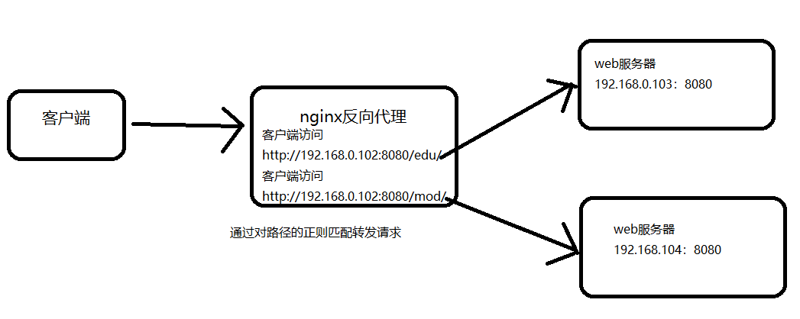
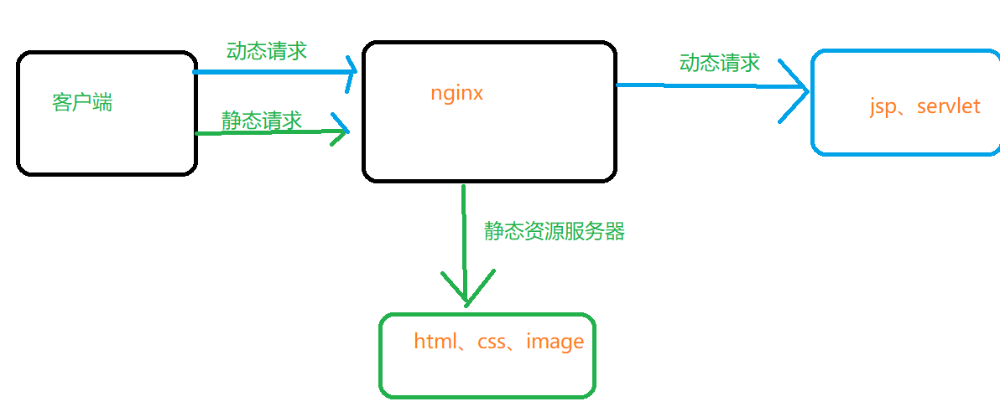

## 1、 配置静态ip

- 进入linux系统

- 编辑/etc/sysconfig/network-scripts/ifcfg-ens33文件
- 添加以及修改几个内容

```shell
# 添加的内容
IPADDR=192.168.222.102  #静态ip
NETMASK=255.255.255.0  #子网掩码
GATEWAY=192.168.222.1   #网关 一般为该网段的第一个
DNS1=8.8.8.8    #可以有多个

# 修改的内容
BOOTPROTO=static      #即设置为静态
```

- 重置网络

```shell
systemctl restart network
```


## 2、开放端口

- 列出已经开放的端口

```shell
firewall-cmd --list-all
```

- 添加端口

```shell
firewall-cmd --add-port=8080/tcp --permanent
```

- 重启防火墙

```shell
firewall-cmd --reload
```


## 3、安装nginx

### 1、安装nginx的依赖


- nginx是由c语言写的，所以需要安装c的编译环境及正则表达式库等第三方依赖

```shell
yum install gcc pcre-devel zlib-devel openssl openssl-devel
```

### 2、下载nginx的压缩包

- 下载wget

```shell
yum install wget
```

- 下载nginx压缩包

```shell
wget https://nginx.org/download/nginx-1.22.1.tar.gz
```

- 解压nginx

```shell
tar xvf nginx-1.22.1.tar.gz
```

- 配置nginx的编译环境

```shell
cd nginx-1.22.1
./configure --prefix=/usr/local/nginx
```

### 3、nginx命令

- 查看版本

```shell
./nginx -v
```

- 启动nginx

```shell
./nginx
```


- 关闭nginx

```shell
./nginx -s stop
```

- 重新加载配置文件

```shel
./nginx -s reload
```


## 4、nginx配置文件

- 共有三部份：全局块、events、http块（http全局块、server块）

```shell
#全局块，到events之前都是：主要是配置一些nginx整体运行的指令


#user  nobody;			#配置nginx服务器的用户组
worker_processes  1;	#允许生成worker process 数  值越大表示nginx处理的并发数量越多

#error_log  logs/error.log;   #日志存放路径以及类型
#error_log  logs/error.log  notice;
#error_log  logs/error.log  info;

#pid        logs/nginx.pid;   #进程pid存放路径


events {
    worker_connections  1024;	#每个worker process可以同时支持的最大连接数
}


http {
    include       mime.types;
    default_type  application/octet-stream;

    #log_format  main  '$remote_addr - $remote_user [$time_local] "$request" '
    #                  '$status $body_bytes_sent "$http_referer" '
    #                  '"$http_user_agent" "$http_x_forwarded_for"';

    #access_log  logs/access.log  main;

    sendfile        on;
    #tcp_nopush     on;

    #keepalive_timeout  0;
    keepalive_timeout  65;

    #gzip  on;

    server {
        listen       80;
        server_name  localhost;

        #charset koi8-r;

        #access_log  logs/host.access.log  main;

        location / {
            root   html;
            index  index.html index.htm;
        }

        #error_page  404              /404.html;

        # redirect server error pages to the static page /50x.html
        #
        error_page   500 502 503 504  /50x.html;
        location = /50x.html {
            root   html;
        }

        # proxy the PHP scripts to Apache listening on 127.0.0.1:80
        #
        #location ~ \.php$ {
        #    proxy_pass   http://127.0.0.1;
        #}

        # pass the PHP scripts to FastCGI server listening on 127.0.0.1:9000
        #
        #location ~ \.php$ {
        #    root           html;
        #    fastcgi_pass   127.0.0.1:9000;
        #    fastcgi_index  index.php;
        #    fastcgi_param  SCRIPT_FILENAME  /scripts$fastcgi_script_name;
        #    include        fastcgi_params;
        #}

        # deny access to .htaccess files, if Apache's document root
        # concurs with nginx's one
        #
        #location ~ /\.ht {
        #    deny  all;
        #}
    }


    # another virtual host using mix of IP-, name-, and port-based configuration
    #
    #server {
    #    listen       8000;
    #    listen       somename:8080;
    #    server_name  somename  alias  another.alias;

    #    location / {
    #        root   html;
    #        index  index.html index.htm;
    #    }
    #}


    # HTTPS server
    #
    #server {
    #    listen       443 ssl;
    #    server_name  localhost;

    #    ssl_certificate      cert.pem;
    #    ssl_certificate_key  cert.key;

    #    ssl_session_cache    shared:SSL:1m;
    #    ssl_session_timeout  5m;

    #    ssl_ciphers  HIGH:!aNULL:!MD5;
    #    ssl_prefer_server_ciphers  on;

    #    location / {
    #        root   html;
    #        index  index.html index.htm;
    #    }
    #}

}
https://download.oracle.com/java/17/latest/jdk-17_linux-x64_bin.tar.gz
```


## 安装一个web服务器

- 下载tomcat

```shell
wget https://dlcdn.apache.org/tomcat/tomcat-10/v10.1.7/bin/apache-tomcat-10.1.7.tar.gz
```

- 进入下载目录解压tomcat

```shell
tar xvf apache-tomcat-10.1.7.tar.gz
```

- 进入tomcat文件夹中的bin目录，启动tomcat

```shell
cd apache-tomcat-10.1.7/bin && ./startup.sh
```


## 5、正向代理


## 6、反向代理

### 1、反向代理一

​	逻辑流程图


- 修改配置文件的server部分

```shell
server {
        listen       80;
        server_name  192.168.0.101;   # 修改1   当前nginx的ip

        #charset koi8-r;

        #access_log  logs/host.access.log  main;

        location / {
        	proxy_pass http://192.168.0.102:8080;	# 修改2   web服务器的ip及端口
            root   html;
            index  index.html index.htm;
        }
```

- 重新加载配置文件

```shell
./nginx -s reload
```

### 2、反向代理二

逻辑图



- 配置文件

```shell
 server {
        listen       8000;
        server_name  192.168.0.102;

        location ~/edu/ {
            proxy_pass http://192.168.0.103:8080;
        }
        location ~/mod/{
        	proxy_pass http://192.168.0.104:8080;
        }
    }

```

- 加载配置文件

```shell
./nginx -s reload
```


其他的正则匹配规则有

```shell
location[ = | ~ | ~* | ^~ ]uri{

}
# 1、=：用于不含正则表达式的uri前，要求请求字符串与uri严格匹配，如果匹配成功就停止向下搜索并立即处理该请求
# 2、~：用于表示uri包含正则表达式，并且区分大小写
# 3、~*:用于表示uri包含正则表达式，并且不区分大小写
# 4、^~:用于不含正则表达式的uri前，要求nginx服务器找到标识uri和请求字符串匹配度最高的location后，立即使用此# # #		 location处理请求，而不再使用location块中的正则uri和请求字符串做匹配。
# 注意：如果uri包含正则表达式，则必须有~或者~*标识
```


## 7、动静分离


逻辑图



- 配置文件

```shell
server {
        listen       8000;
        server_name  192.168.0.102;

        location /www/ {
        	root /data/;
        	autoindex on;  # 列出当前文件夹里的所有文件
            
        }
        
    }

```


## 8、负载均衡

​	逻辑图


- 配置文件

```shell
  # 添加的部分
  upstream myserver{
  server 192.168.0.103:8080;
  server 192.168.0.104:8080;
  }
  server {
        listen       80;
        server_name  192.168.0.102;

        #charset koi8-r;

        #access_log  logs/host.access.log  main;

        location / {
        	proxy_pass http://myserver;	#添加的部分二
            root   html;
            index  index.html index.htm;
        }

```

- 重加载配置文件

```shell
./nginx -s reload
```

负载均衡的分发策略

- 轮询（默认）

```shell
# 添加的部分
  upstream myserver{
  server 192.168.0.103:8080;
  server 192.168.0.104:8080;
  }
  server {
        listen       80;
        server_name  192.168.0.102;

        #charset koi8-r;

        #access_log  logs/host.access.log  main;

        location / {
        	proxy_pass http://myserver;	#添加的部分二
            root   html;
            index  index.html index.htm;
        }

```


- 加权:根据权重比例分配客户端请求

```shell
# 添加的部分
  upstream myserver{
  server 192.168.0.103:8080 weight=5;
  server 192.168.0.104:8080 weight=10;
  }
  server {
        listen       80;
        server_name  192.168.0.102;

        #charset koi8-r;

        #access_log  logs/host.access.log  main;

        location / {
        	proxy_pass http://myserver;	#添加的部分二
            root   html;
            index  index.html index.htm;
        }

```

- ip_hash:每个请求按照ip的hash结果进行转发，这样每个ip只能固定访问一个web服务器，可以解决session问题

```shell
# 添加的部分
  upstream myserver{
  ip_hash;
  server 192.168.0.103:8080;
  server 192.168.0.104:8080;
  }
  server {
        listen       80;
        server_name  192.168.0.102;

        #charset koi8-r;

        #access_log  logs/host.access.log  main;

        location / {
        	proxy_pass http://myserver;	#添加的部分二
            root   html;
            index  index.html index.htm;
        }

```

- fair:按照后端服务器的响应时间来进行分配，响应时间短的优先分配

```shell

# 添加的部分
  upstream myserver{
  server 192.168.0.103:8080;
  server 192.168.0.104:8080;
  fair;
  }
  server {
        listen       80;
        server_name  192.168.0.102;

        #charset koi8-r;

        #access_log  logs/host.access.log  main;

        location / {
        	proxy_pass http://myserver;	#添加的部分二
            root   html;
            index  index.html index.htm;
        }

```


## 9、高可用

逻辑图


- 安装keepalived

```shell
yum install keepalived -y
```

- 进入/etc/keepalived
- 修改keepalived.conf文件

```shell
global_defs {
   notification_email {
     acassen@firewall.loc
     failover@firewall.loc
     sysadmin@firewall.loc
   }
   notification_email_from Alexandre.Cassen@firewall.loc
   smtp_server 192.168.200.1
   smtp_connect_timeout 30
   router_id LVS_DEVEL			#主机名字  注意：这个名字要加入到hosts文件中
   vrrp_skip_check_adv_addr
   vrrp_strict
   vrrp_garp_interval 0
   vrrp_gna_interval 0
}：q
# 加入的内容一
vrrp_script chk_http_port{   # 整段都加入
	script "/usr/local/nginx/conf/nginx_check.sh"     # 脚本文件地址
	
	interval 2   # 检测脚本执行的间隔
	
	weight 2

}

vrrp_instance VI_1 {
    state MASTER	#备份服务器上将MASTER改为BACKUP     修改的内容二
    interface eth0		# 网卡						修改的内容三
    virtual_router_id 51	# 主、备份机的virtual_router_id必须相同     修改的内容四
    priority 100			# 主、备机取不同的优先级，主机优先级大，备份机次之   修改的内容五
    advert_int 1
    authentication {
        auth_type PASS
        auth_pass 1111
    }
    virtual_ipaddress {  # 虚拟ip地址
        192.168.200.16
        192.168.200.17
        192.168.200.18
    }
}
```

- 脚本文件nginx_check.sh

```shell
#!/bin/bash
A=`ps -C nginx -no-header |wc -l`
if [ $A -eq 0];then
	/usr/local/nginx/sbin/nginx
	sleep 2
	if [ `ps -C nginx --no-header |WC -l` -eq 0 ];then
		killall keepalived
	fi
fi
```

- 编辑/etc/hosts

```shell
127.0.0.1 LVS_DEVEL   #在文件中添加这一行
```


- 启动keepalived

```shell
systemctl start keepalived.service
```

- 重新启动网络

```shell
systemctl restart network
```


